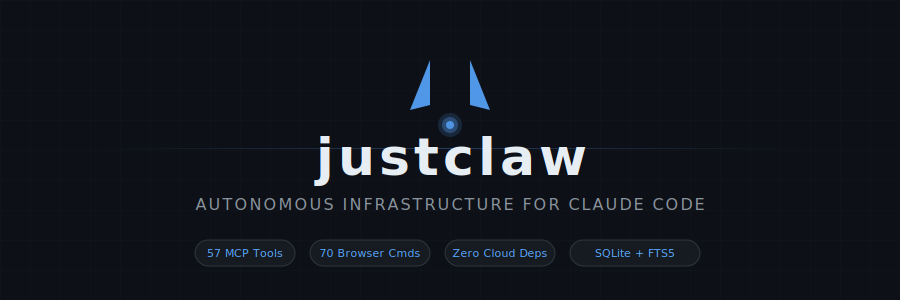

<p align="center">
  
</p>

<p align="center">
  <a href="#quick-start"></a>
  <a href="https://github.com/unattachedgray/justclaw"></a>
  <a href="LICENSE"></a>
  
  
  
</p>

<p align="center">
  <b>Turn Claude Code into an always-on autonomous agent.</b><br/>
  Persistent memory · Task queue · Health monitoring · Browser automation · Discord interface<br/>
  All backed by SQLite. Zero cloud dependencies. One <code>npm install</code>.
</p>

---

## The Problem

Claude Code is already one of the most capable AI coding agents in the world. But every session starts from scratch — no memory of yesterday's conversations, no awareness of pending tasks, no way to heal itself between sessions, no long-running automation.

**Most agent frameworks try to replace the LLM's reasoning with thousands of lines of orchestration code** — custom planners, tool routers, memory systems, retry loops. They rebuild what Claude Code already does well.

## The justclaw Approach

**Don't replace Claude Code. Extend it.**

justclaw is an [MCP server](https://modelcontextprotocol.io/). Claude Code connects to it over stdio like any other tool. When Claude needs to remember something, it calls `memory_save`. When it needs work to do, it calls `task_next`. When it needs to check on itself, deterministic health checks run in pure TypeScript — no LLM calls, no cost, under 1 second.

The result: Claude Code sessions that **persist across restarts**, **self-heal when things break**, **run scheduled tasks autonomously**, and **learn from their mistakes** — all without a custom agent framework.

```
┌─────────────────────────────────────────────────────────────┐
│  Claude Code CLI (the brain — already world-class)          │
│  ┌───────────────────────────────────────────────────────┐  │
│  │  justclaw MCP Server (57 tools via stdio)             │  │
│  │  ┌─────────┐ ┌──────┐ ┌────────┐ ┌─────────────────┐│  │
│  │  │ Memory  │ │Tasks │ │Health  │ │ Browser Bridge  ││  │
│  │  │ FTS5    │ │Cron  │ │10checks│ │ 70 commands     ││  │
│  │  │ Dedup   │ │Deps  │ │$0/cycle│ │ Self-healing    ││  │
│  │  └────┬────┘ └──┬───┘ └───┬────┘ │ selectors       ││  │
│  │       │         │         │      └─────────────────┘│  │
│  │  ┌────┴─────────┴─────────┴──────────────────────┐  │  │
│  │  │      SQLite (WAL, FTS5, schema v15)           │  │  │
│  │  └───────────────────────────────────────────────┘  │  │
│  └───────────────────────────────────────────────────────┘  │
│        │              │              │                       │
│   Dashboard      Discord Bot    Heartbeat                   │
│   Hono :8787     Streaming      Monitors                    │
│   Live metrics   Sessions       Escalation                  │
└─────────────────────────────────────────────────────────────┘
```

## Why justclaw?

<table>
<tr>
<td width="50%">

### Other agent frameworks
- Wrap the LLM in custom orchestration
- Require cloud infrastructure
- Replace Claude's native tool use
- Custom memory that doesn't integrate
- Separate runtime from the IDE

</td>
<td width="50%">

### justclaw
- **Claude Code IS the agent** — justclaw just gives it persistence
- **SQLite only** — runs on a Raspberry Pi, no cloud bills
- **MCP protocol** — native integration, no wrappers
- **Memory that survives restarts** — FTS5 search, namespaces, dedup
- **Lives in your terminal** — same `claude` command you already use

</td>
</tr>
</table>

### What makes it different

**Deterministic first, LLM only when reasoning is genuinely needed.** Every health check, process audit, threshold evaluation, and document chunk is pure TypeScript — SQL queries, `/proc` reads, PID comparisons, FTS5 search. The 10 heartbeat checks run in under 1 second at zero cost. LLM reasoning is reserved for diagnosing novel issues that persist after deterministic checks fail.

**Conservative by default.** justclaw will never kill a process it didn't spawn (verified via `/proc/cmdline` + SQLite registry), never auto-modify source code from automated troubleshooting, never silently swallow errors, and never make destructive changes without evidence.

**Two-phase scheduled tasks.** Reports and recurring work split into preparation (AI research, compile, archive to GitHub) and delivery (deterministic scripts for email/posting at the exact scheduled time). The AI can take 45 minutes to research; the email still sends at 8:40 AM sharp.

## Quick Start

```bash
git clone https://github.com/unattachedgray/justclaw.git
cd justclaw
bash scripts/setup.sh    # Interactive — walks you through everything
```

Or manually:

```bash
npm install && npm run build
cp .env.example .env     # Add your Discord token, SMTP config
pm2 start ecosystem.config.cjs
```

**MCP-only mode** (no Discord, no dashboard — just persistent memory and tasks):

```bash
npm install && npm run build
# Run `claude` from this directory — .mcp.json auto-registers all 57 tools
```

## Features

### 🧠 Persistent Memory (6 tools)

FTS5 full-text search, namespaces, access tracking, expiry, autodream-inspired dedup and consolidation. Claude remembers what happened yesterday, last week, and what it learned from mistakes.

### 📋 Task Queue (9 tools)

Dependencies, agent claiming, recurring tasks with cron expressions, per-task output channel routing. Template system with `{{variable}}` interpolation. Two-phase execution separates AI prep from deterministic delivery.

### 🔄 Self-Improvement Loop (Hermes-inspired)

Inspired by Nous Research's Hermes Agent, justclaw continuously learns from its own execution:

- **Auto Skill Extraction** — when a task scores 80+, the system records what worked (sections found, duration, content quality) as a `skill` learning. One per template per week to avoid noise.
- **Proactive Learning Injection** — task preambles include area-relevant learnings, high-confidence playbook entries, and past execution results. If email failed yesterday, today's report task knows about it before starting.
- **Priority-Based Context Assembly** — preamble sections are scored by priority and trimmed to a 4K token budget. Low-priority items (daily log, older skills) are dropped first. Inspired by Cursor's "Preempt" system.
- **Template Performance Tracking** — per-template stats (run count, avg score, avg duration, success streak) stored in the `state` table. After 3+ runs, stats are injected into task preambles. Three consecutive failures auto-record an error learning.
- **Enhanced Playbooks** — learnings applied 3+ times are promoted to playbook entries with Bayesian confidence scoring, success criteria, guardrails, and auto-extracted step-by-step procedures. Unused entries decay over 30 days.
- **Step Budgets** — tasks can have `max_steps` limits enforced during `claude -p` execution. Prevents runaway agent loops (a key failure mode identified in AutoGPT analysis).
- **Git Checkpoints** — HEAD ref saved before tasks that modify repos. Enables rollback on failure. Inspired by Cline's checkpoint/rollback system.

### 🔍 Health Monitoring (10 checks, $0/cycle)

Process registry audit, stale process scan, PM2 health, unanswered messages, system status, stuck tasks, doc staleness, event loop lag, memory usage, system resources. When deterministic checks fail for 3+ cycles, Claude diagnoses and recommends fixes — and past diagnoses inform future ones.

### 🌐 Browser Bridge (70 commands)

Chrome extension with full browser automation: screenshots, form fill, data extraction, Set-of-Mark visual grounding, natural language element search, self-healing selectors with persistent caching, HAR capture, device emulation, shadow DOM piercing, iframe access, and multi-step workflows.

### 📊 Metric Monitoring (6 tools, Huginn-style)

Track anything: crypto prices, website uptime, API latency, disk usage, web page changes. Sources (URL or shell command) × Extractors (jsonpath, regex, status code, response time) × Conditions (threshold, change, contains, regex). Alerts escalate from ALERT → CRITICAL after 3 consecutive triggers.

### 📚 Document Analysis (6 tools, NotebookLM-style)

Point at any folder → ingests 60+ file formats (PDF, DOCX, XLSX, PPTX, HTML, EPUB, images, code). Small doc sets load entirely into Claude's context window; larger sets use FTS5 BM25 retrieval. Source-grounded answers with `[source:filename:lines]` citations.

### 🎯 Session Continuity ("Always-On Agent")

Session IDs persist in SQLite across bot restarts. Every prompt gets an identity preamble: last context snapshot, active goals, pending tasks, today's activity, recent learnings. Message coalescing, auto-flush at 20 turns, rotation at 30 turns with structured handover. Every session feels like the same agent waking up.

### 🤖 Discord Bot

Stream Claude's responses with real-time progress display. Per-channel message queue with circuit breaker. Multi-turn sessions via `--resume`. Graceful shutdown with process group management.

### 🎨 Gemini AI Integration (5 tools)

Image generation and iterative editing, PDF analysis, vision/OCR, Google Search-grounded answers with citations. Tool descriptions steer Claude to prefer native capabilities over API calls.

### 📅 Two-Phase Scheduled Tasks

```
[due_at - lead_time]              [due_at]
       |                              |
  PREP PHASE                    DELIVERY PHASE
  (claude -p)                  (deterministic)
       |                              |
  research + compile             send-email.sh
  git-archive.sh                 Discord post
  save to /tmp/                  mark complete
```

Templates use `---DELIVERY---` and `---SCHEMA---` separators. Everything above `---DELIVERY---` is the AI prompt; delivery commands run deterministically at the scheduled time. `---SCHEMA---` defines expected output structure (required sections, min content length, link verification) for post-task validation. Lead time via `lead:N` tag — task starts N minutes early, delivery waits.

### 🛡️ Infrastructure

- **Web dashboard** — Hono :8787 with SSE, live token sparkline, agent throughput, activity heatmap, monitor status grid, system resource charts
- **7 default monitors** — dashboard uptime, disk/RAM, Discord bot health, GitHub repo, Bitcoin, Anthropic API status
- **Safe deploy** — `npm run deploy` builds, tests, git-tags, restarts, monitors 60s, auto-rolls back on crash
- **Crash watchdog** — cron detects crash loops, auto-reverts to last stable tag
- **Process registry** — 3-layer kill policy with PID reuse protection and safety scoring
- **Filter pipeline** — composable middleware for all `claude -p` calls (token metering, audit logging, duration tracking)
- **Message routing** — deterministic intent classifier routes Discord messages to focused prompts before LLM fallback
- **Workflow engine** — chain multiple task templates into sequential pipelines with dependency management
- **Shadow validation** — `tsc --noEmit` check for tasks that modify TypeScript code

### 🛠️ Development Skills

| Skill | Purpose |
|-------|---------|
| `/dev <mode>` | 7-phase lifecycle: think → plan → build → review → test → ship → reflect |
| `/build [prd]` | PRD-driven autonomous build loop with quality gates |
| `/notebook <cmd>` | Document-grounded analysis with source citations |
| `/monitor <cmd>` | Configurable metric watchers with alerts |
| `/code-review` | Multi-agent parallel review (style, security, perf, architecture) |
| `/postmortem` | 5-agent incident analysis team |
| `/improve`, `/audit`, `/retrospective` | Continuous self-improvement |

## Prerequisites

| Requirement | Version | Notes |
|------------|---------|-------|
| Node.js | >= 20 | `node -v` |
| Claude Code CLI | latest | `npm i -g @anthropic-ai/claude-code` |
| PM2 | any | `npm i -g pm2` (for Discord bot / dashboard) |
| Build tools | any | `build-essential` (Linux) or Xcode CLI (macOS) |

## Configuration

<details>
<summary><b>Environment Variables (.env)</b></summary>

| Variable | Required | Default | Description |
|----------|----------|---------|-------------|
| `DISCORD_BOT_TOKEN` | For Discord | — | From Discord Developer Portal |
| `DISCORD_CHANNEL_IDS` | No | all | Channels to respond in |
| `DISCORD_HEARTBEAT_CHANNEL_ID` | No | first channel | Health alert channel |
| `HEARTBEAT_INTERVAL_MS` | No | 300000 | Health check interval (ms) |
| `DASHBOARD_PASSWORD` | No | changeme | Dashboard login |
| `GEMINI_API_KEY` | For images | — | Google Gemini API key |
| `SMTP_HOST` | For email | — | e.g., smtp.gmail.com |
| `SMTP_PORT` | For email | 587 | SMTP port |
| `SMTP_USER` | For email | — | SMTP login |
| `SMTP_PASS` | For email | — | SMTP password / app password |

</details>

<details>
<summary><b>Timezone</b></summary>

All timestamps stored in UTC. Display times converted automatically.

```
state_set(key: "timezone_home", value: "America/New_York")
state_set(key: "timezone_current", value: "Asia/Seoul")       # travel override
state_set(key: "timezone_current", value: "")                 # revert to home
```

When a current timezone is active, displays show both: `2:50 PM KST current / 8:50 AM EDT home`

</details>

<details>
<summary><b>Discord Bot Setup</b></summary>

1. Go to [Discord Developer Portal](https://discord.com/developers/applications)
2. Create application → **Bot** tab → **Reset Token** → copy. Enable **MESSAGE CONTENT** intent.
3. **OAuth2 > URL Generator**: Scopes = `bot`, Permissions = Send Messages, Read Message History, Add Reactions
4. Open the URL to add the bot to your server
5. Add token to `.env` as `DISCORD_BOT_TOKEN`

</details>

<details>
<summary><b>Chrome Extension (Browser Bridge)</b></summary>

1. Open `chrome://extensions`
2. Enable **Developer mode** (top-right)
3. **Load unpacked** → select `browser-extension/` folder
4. Dashboard must be running (`pm2 list`) — extension communicates via `localhost:8787`

</details>

## Commands

```bash
npm run build            # Compile TypeScript
npm run dev              # Development with hot reload
npm test                 # Run test suite
npm run deploy           # Safe deploy with auto-rollback
pm2 list                 # Check service status
pm2 logs justclaw-discord     # View bot logs
```

## Documentation

| Document | Content |
|----------|---------|
| [CLAUDE.md](CLAUDE.md) | Development guide, architecture, all tools |
| [docs/MCP-TOOLS.md](docs/MCP-TOOLS.md) | Complete MCP tool reference (57 tools) |
| [docs/DISCORD-BOT.md](docs/DISCORD-BOT.md) | Discord bot internals, session continuity |
| [docs/BROWSER-BRIDGE.md](docs/BROWSER-BRIDGE.md) | Browser automation (70 commands) |
| [docs/DASHBOARD.md](docs/DASHBOARD.md) | Dashboard API, widgets, monitors |
| [docs/PROCESS-MANAGEMENT.md](docs/PROCESS-MANAGEMENT.md) | Process registry and kill policy |
| [docs/SCHEMA.md](docs/SCHEMA.md) | Database schema (v15) |
| [docs/development.md](docs/development.md) | Development roadmap (13-project analysis) |

## Roadmap

- [x] Two-phase scheduled tasks (prep + deterministic delivery)
- [x] Self-improvement loop (Hermes-inspired skill extraction, playbook crystallization)
- [x] 15 agent-inspired features from 13-project analysis (see [development.md](docs/development.md))
- [ ] Multi-agent coordination (parallel claude -p with shared task queue)
- [ ] Webhook triggers (GitHub, Slack, email → auto-create tasks)
- [ ] Plugin system for custom MCP tool modules
- [ ] Mobile dashboard (PWA)
- [ ] Voice interface via Discord voice channels

## Release Notes

### v0.3.0 — Agent Intelligence (2026-03-27)

15 features inspired by analysis of 13 agent frameworks (CrewAI, AutoGen, LangGraph, OpenHands, SWE-Agent, Aider, MetaGPT, Devin, Cursor, Cline, AutoGPT, Semantic Kernel, BabyAGI):

- **Priority-based context assembly** — preamble sections scored and trimmed to token budget (from Cursor)
- **Past execution injection** — task preamble shows last 3 runs of same template (from BabyAGI)
- **Git checkpoints** — HEAD ref saved before tasks that modify repos (from Cline)
- **Enhanced reflection** — output file verification, git success detection, thin section detection (from MetaGPT)
- **Step budgets** — `max_steps` on tasks, enforced during streaming (from AutoGPT failures)
- **Enhanced playbooks** — success criteria, guardrails, auto-extracted steps (from Devin)
- **Filter pipeline** — composable middleware for all `claude -p` calls (from Semantic Kernel)
- **Output schemas** — `---SCHEMA---` section in templates for structural validation (from MetaGPT)
- **Watch/subscribe filtering** — concern mapping for targeted escalation (from MetaGPT)
- **Token-aware condensation** — flush based on token estimates, not just turn count (from OpenHands)
- **Resumable checkpoints** — `task_checkpoints` table for intermediate state (from LangGraph)
- **Hybrid speaker routing** — deterministic message classifier before LLM fallback (from AutoGen)
- **Trigger-based skills** — keyword detection injects only relevant skills (from OpenHands)
- **Shadow validation** — `tsc --noEmit` for tasks modifying TypeScript (from Cursor)
- **Workflow chaining** — sequential task pipelines from workflow definitions (from CrewAI)

Schema v14 → v15. 5 new source files. Full analysis in [docs/development.md](docs/development.md).

### v0.2.0 — Self-Improvement & Two-Phase Tasks (2026-03-27)

- **Two-phase scheduled tasks** — templates split on `---DELIVERY---`; AI prepares during lead time, deterministic scripts deliver at `due_at`
- **Auto skill extraction** — successful tasks auto-record what worked as skill learnings
- **Proactive learning injection** — area-relevant learnings and playbook entries in task preambles
- **Template performance tracking** — per-template stats with failure streak detection
- **20-minute task timeout** — up from 8 minutes; prevents premature SIGTERM on research-heavy reports

### v0.1.0 — Foundation

- 57 MCP tools (memory, tasks, goals, learnings, notebooks, monitors, conversations, context, process, system)
- Discord bot with streaming progress, session continuity, circuit breaker
- 9 deterministic heartbeat checks ($0/cycle)
- Browser bridge (70 commands via Chrome extension)
- Goal-driven LLM escalation with healing verification
- Dashboard (Hono :8787) with activity heatmap, token usage, monitors

## License

MIT — use it, fork it, make Claude Code remember everything.
